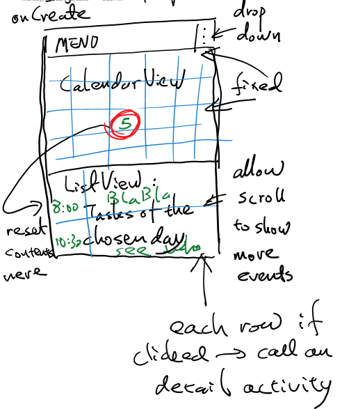

## Feb 10 2016
+ discussed about project topic, we decided to work on a calendar app. 

## Feb 17 2016
+ discussed about the layout for the main activity.

## Feb 21 2016
+ initial layout for the main activity created

## March 4 2016
+ wrote a project description, see Casca_Project_Description.pdf

## April 17 2016
+ Created three activities:
  1. main_activity will display the calendar and list of events for a given day
  2. addEvent will allow user to specify information about an event and write event information into the database
  3. displayDetial will show user the detailed information about an given event and also enable user to use TTS, maps and sms sharing
+ Created SQLite database helper for the app
+ Wrote code to create table and insert data into table
+ Create a event class, will be used to represent event

## April 20 2016
+ We had a problem when trying to push the updates from Yuge to the master branch, we did a rebase
+ Logs for previous commits now lost in this online repo, but remains on Yuge's laptop
+ We added more widgets for the addEvent activity

## April 24 2016
+ Wrote code to insert event based on the info user entered in addEvent activity
+ Wrote code to filter the events listed in the listView in main_activity, we can sepcify a date and only show events of that day
+ Wrote code to pass the id of the event been clicked at main_activity and when displayDetail is started, we now query that event and display the info to user.
