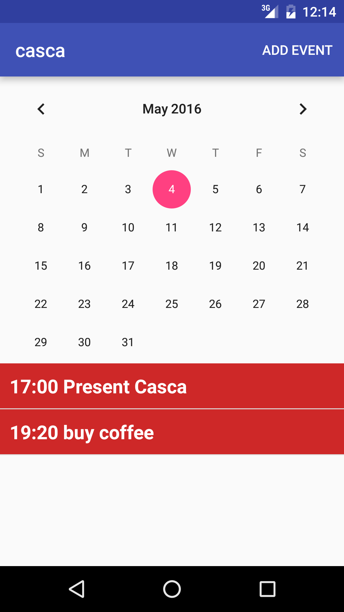
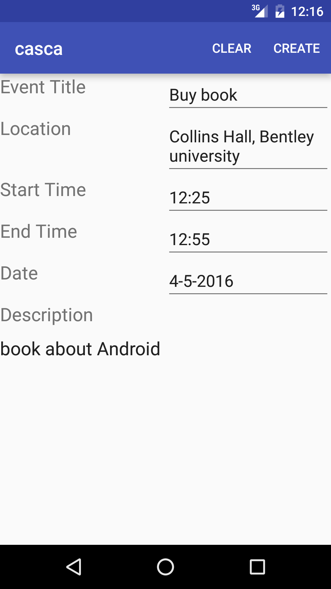
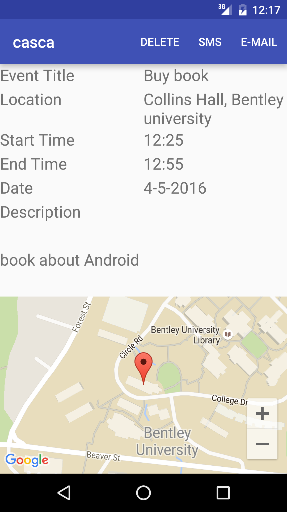
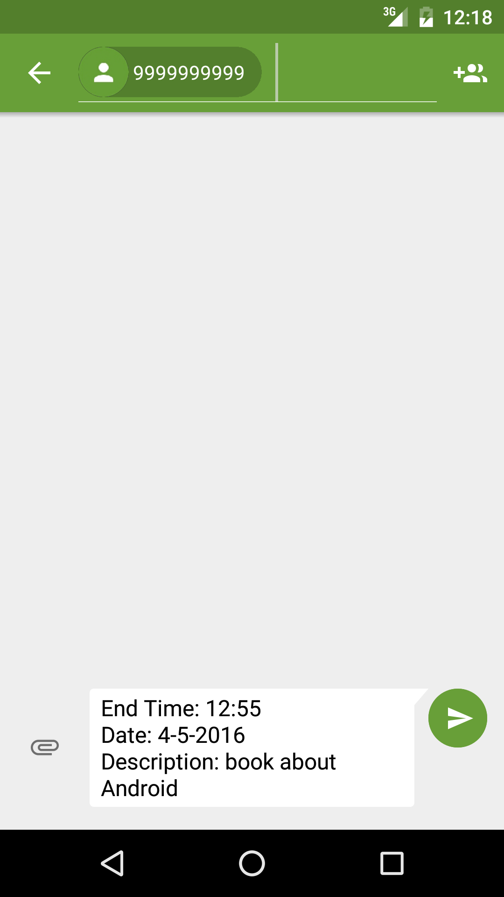
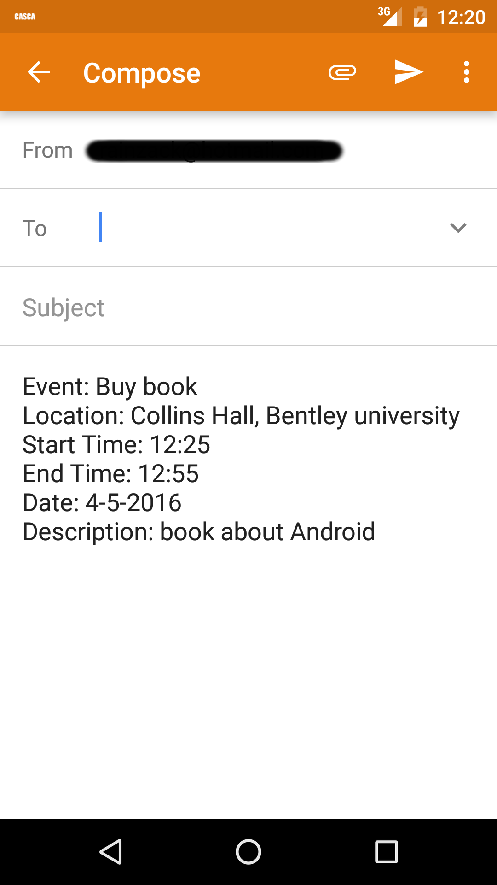
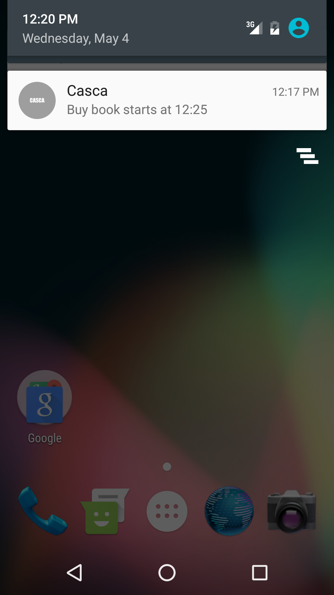

# CASCA: A clean calender application for Android Devices
## Group Project for CS680 @ Bentley University
## Team Members: 
  + Ryan Zhang[https://github.com/ryancheunggit]    
  + Yuge Xiao[https://github.com/YugeX]    
  + Yasha Guo[https://github.com/gys110110]    
## Description   
CASCA is a light weight easy to use android calendar application with minimal design principal.   
Main features:
  + With a simple finger tip touch, CASCA will read out the event information for busy users
  + A map that indicating the location for every event you planned with CASCA
  + Sharing the events to friends with SMS and Email
  + Notification that remainds you want you have set out to do
## Screen Shots     

      
 

